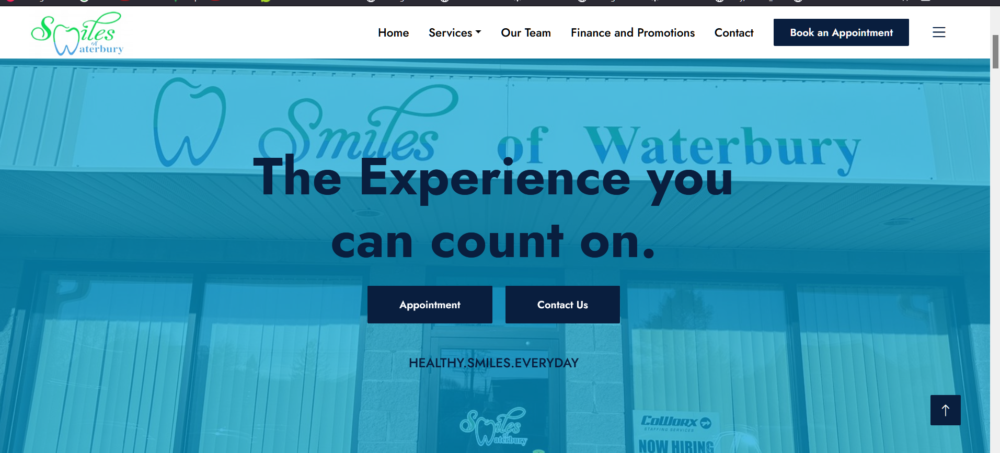
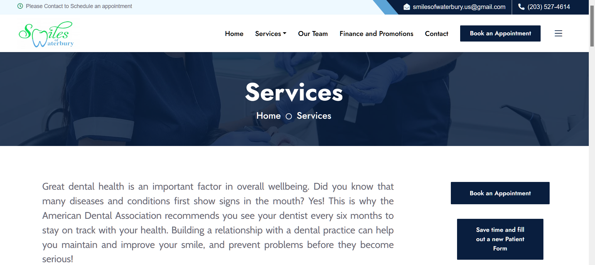
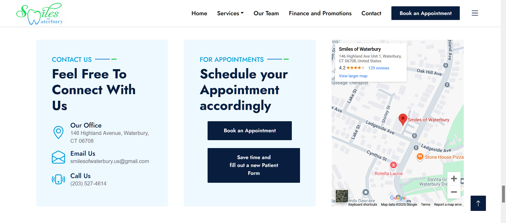

Below is an updated **README.md** with references to the specific image filenames (e.g., `img/a.png`, `img/b.png`, etc.) and additional details about the project’s pages, fonts, and setup. Feel free to modify any sections to match your exact file names or project requirements.

---

# Smiles of Waterbury – Dental Website

A responsive dental website for **Smiles of Waterbury**, showcasing various dental services, contact information, and an easy appointment booking process.

**Live Demo:** [Smiles of Waterbury on GitHub Pages](https://rohanpatil2.github.io/dental_web/index.html)  
**Repository:** [GitHub – RohanPatil2/dental_web](https://github.com/RohanPatil2/dental_web)

---

## Table of Contents
1. [Project Overview](#project-overview)  
2. [Features](#features)  
3. [Screenshots](#screenshots)  
4. [Technologies Used](#technologies-used)  
5. [Pages Included](#pages-included)  
6. [Folder Structure](#folder-structure)  
7. [Installation & Setup](#installation--setup)  
8. [Usage](#usage)  
9. [Contributing](#contributing)  
10. [License](#license)  
11. [Contact](#contact)

---

## Project Overview

**Smiles of Waterbury** provides a modern, user-friendly platform for patients to explore dental services, learn about procedures, and conveniently schedule appointments. This website includes dedicated pages for services (e.g., fillings, extractions, crowns), a contact page, a finance page, and an embedded map for easy navigation. A downloadable new patient form (PDF) is also provided.

---

## Features

- **Responsive Layout** – Adapts to desktop, tablet, and mobile devices.  
- **Comprehensive Services** – Separate pages for different treatments (crowns, fillings, implants, etc.).  
- **Appointment Page** – “Book an Appointment” functionality and a new patient form (PDF).  
- **Contact Information** – Clear phone number, address, and email details.  
- **Google Map Embed** – Helps users locate the clinic quickly.  
- **Clean Navigation** – A straightforward menu for easy browsing across pages.  
- **Custom Fonts** – Includes the Cabin font family with an open font license.

---

## Screenshots

Here are some example screenshots. Adjust the file paths and alt text as needed for your actual images:

1. **Homepage**  
   

2. **Services Section**  
   

3. **Contact Page**  
   

*(Make sure your actual image files in the `img/` folder match these names: `a.png`, `b.png`, `c.png`, etc. If they differ, update the file names in the markdown.)*

---

## Technologies Used

- **HTML5**  
- **CSS3** (with optional SCSS if applicable)  
- **JavaScript**  
- **Bootstrap** (if used for layout/components)  
- **GitHub Pages** (for deployment)  
- **Cabin Font Family** (with [OFL.txt](https://scripts.sil.org/OFL) license included)

---

## Pages Included

This project includes a variety of HTML pages to cover different aspects of dental services:

- **index.html** – Homepage with a welcome message and main navigation.  
- **about.html** – About the clinic or practice.  
- **appointment.html** – Page to book an appointment (includes a PDF form).  
- **childrenden.html** – Pediatric dentistry services.  
- **contact.html** – Contact information and embedded Google Map.  
- **crowns.html** – Information about dental crowns.  
- **dentures.html** – Information about dentures.  
- **extractions.html** – Information about tooth extractions.  
- **filling.html** – Information about dental fillings.  
- **finance.html** – Financing options or insurance information.  
- **implants.html** – Information about dental implants.  
- **invisalign.html** – Information about Invisalign services.  
- **new_patient_form(1).pdf** – Downloadable PDF form for new patients.  
- **periodontal.html** – Periodontal treatments.  
- **price.html** – Pricing details or offers.  
- **rootcanal.html** – Information about root canal therapy.  
- **service.html** – Overview of all services offered.  
- **team.html** – Meet the dentist(s) and staff.  
- **testimonial.html** – Patient testimonials.  
- **veneers.html** – Information about dental veneers.  
- **whitening.html** – Teeth whitening services.

---

## Folder Structure

Below is a simplified overview of the repository:

```
dental_web/
│
├── css/
│   └── ... (CSS files, e.g., style.css)
├── img/
│   ├── a.png
│   ├── b.png
│   └── c.png
├── js/
│   └── ... (JavaScript files, e.g., script.js)
├── lib/
├── scss/
├── static/
│
├── Cabin-Italic-VariableFont_wdth,wght.ttf
├── Cabin-VariableFont_wdth,wght.ttf
├── OFL.txt
├── README.txt
│
├── about.html
├── appointment.html
├── childrenden.html
├── contact.html
├── crowns.html
├── dental-clinic-website-template.jpg
├── dentures.html
├── extractions.html
├── filling.html
├── finance.html
├── implants.html
├── index.html
├── invisalign.html
├── new_patient_form(1).pdf
├── periodontal.html
├── price.html
├── rootcanal.html
├── service.html
├── team.html
├── testimonial.html
├── veneers.html
└── whitening.html
```

---

## Installation & Setup

1. **Clone the repository**  
   ```bash
   git clone https://github.com/RohanPatil2/dental_web.git
   ```

2. **Navigate into the project folder**  
   ```bash
   cd dental_web
   ```

3. **Open the project**  
   - Double-click `index.html` to open it in your web browser, or  
   - Use a local server (e.g., the Live Server extension in VSCode) for a better development experience.

4. **(Optional) SCSS Compilation**  
   - If you use SCSS files in the `scss/` folder, compile them to CSS using a SASS compiler (e.g., `sass scss/style.scss css/style.css`).

---

## Usage

- **Local**  
  Open `index.html` in your web browser or launch a local server to explore the website and test functionality.  
- **Online**  
  Visit the live demo on [GitHub Pages](https://rohanpatil2.github.io/dental_web/index.html) to see the deployed website.

---

## Contributing

1. **Fork the repository** on GitHub.  
2. **Create a new branch** for your changes:  
   ```bash
   git checkout -b feature/my-new-feature
   ```
3. **Commit your changes**:  
   ```bash
   git commit -m "Add some new feature"
   ```
4. **Push to the branch**:  
   ```bash
   git push origin feature/my-new-feature
   ```
5. **Create a Pull Request** to discuss, review, or merge your changes.

---

## License

This project does not currently specify a license in the repository. You can add or update a license file (e.g., MIT, Apache, GPL) if you wish.  

*(If you decide to use MIT License, for instance, add a `LICENSE` file and update this section accordingly.)*

---

## Contact

For any inquiries or feedback:

- **Email**: [smilesofwaterbury@gmail.com](mailto:smilesofwaterbury@gmail.com)  
- **Phone**: (203) 527-6074  
- **Address**: 164 Highland Avenue, Waterbury, CT 06708  

Alternatively, open an [issue](https://github.com/RohanPatil2/dental_web/issues) in this repository.

---

**Thank you for visiting Smiles of Waterbury!**  
We hope this website provides a helpful resource for dental patients. Feel free to submit any improvements or suggestions.
